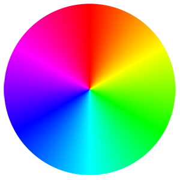
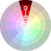
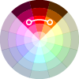
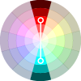
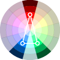
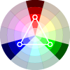
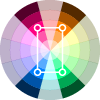
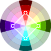

<h1 align="center" name="top">Color</h1>
<p align="center">A color API to easily handle color variation to create dynamic color theme.</p>

---

<br>

> **Attention :**
> This version will soon change with breaking changes,
> A single object parameter will allow to have named arguments for a better developper experience.

<br>
<ul>
   <li><a href="#introduction-">Introduction</a></li>
   <li><a href="#in-short-">In short</a></li>
   <li><a href="#for-those-who-arent-familiar-with-color-theory-">Brief introduction to color theory</a>
      <ul>
      <li><a href="#color-properties-">Color properties</a></li>
      <li><a href="#color-value-">Color value</a></li>
      <li><a href="#color-harmonies-">Colors harmonies</a></li>
      <li><a href="#the-hsl-solution-">The HSL solution</a></li>
      </ul>
   </li>
   <li><a href="#the-color-api-">The Color API</a></li>
      <ul>
      <li><a href="#create-a-color-">Creation of a Color</a></li>
      <li><a href="#create-a-child-color-">Creation of a child Color</a></li>
      <li><a href="#constructor-parameters-">Constructor parameters</a></li>
      <li><a href="#properties-">Properties</a></li>
      <li><a href="#methods-">Methods</a></li>
      </ul>
   <!--<li><a href="#exemples-">Exemples</a></li>-->
</ul>

---

<br>

## Introduction :

`Color` allows to easily handle color manipulation with access to each aspect of it (hue, saturation, light, alpha).
For exemple, you can dynamically set [_tint_, _tone_ and _shade_](#for-those-who-arent-familiar-with-color-theory-) of a color by changing only the `saturation` or `light` properties.

A main `Color` can be a reference, linked by a other `Color` with some offset in `saturation` for exemple.
That allows you to create a dynamic color theme through a set of linked `Color` which will adapt to any change from the main one.
<br>

<h6 align="right"><a href="#top"> back to top ⇧</a></h6>

---

<br>

## In short :

<br>

A simple HSL model :

```js
const {hue, saturation, light} = {360, 90, 70}
const mainColor = new Color(hue, saturation, light); // a soft red
```

<br>

References to link Color through a dynamic theme :

```js
const darkMainColor = new Color(mainColor, null, -30);
// mainColor as reference, with a -30 offset in light :
darMainColor.toHsl(); // "hsl(360, 90%, 40%)"
```

```js
mainColor.hue = 30; // If the main color change,
// All dependant Color will change accordingly :
darkMainColor.toHsl(); // "hsl(30, 90%, 40%)"
```

<br>

Simple offset or callback to fine-tune the relation between colors :

```js
const alpha = 30;
const shadowColor = new Color(mainColor, sat => sat / 2, -40, alpha);
// Callback give access to the reference property value
shadowColor.toHsl(); // "hsla(30, 45%, 30%, 30%)"
```

<br>
<h6 align="right"><a href="#top"> back to top ⇧</a></h6>

---

<br>

## For those who aren't familiar with color theory :

<div align="center"><figure>

<figcaption><h6><i>The color wheel.</i></h6></figcaption>
</figure></div>

<br>
<br>

### Color properties :

Colors can be describe by 3 properties : <i>Hue</i>, <i>intensity</i> and <i>value</i>.

<br><dl>

<dt>Hue :</dt>
<dd>The <b>pure color</b> value on which the color is based.<br>
From 0 to 360°, it indicates the color position on the color wheel.<br>
This pure color is visible at full <i>intensity</i> and a neutral <i>value</i> (no black or white added).

</dd>

<dt>Intensity :</dt>
<dd>The <b>saturation</b> of the color :<br>
It describe the brightness or dullness of the color. <br>
Intensity is highest with the pure color (hue). <br>
Intensity is low when a color is dull, tends to a gray.
<dd>

<dt>Value :</dt>
<dd>Describes the degree of lightness or darkness in color.<dd>

</dl>
<br>
<br>
<br>

### Color value :

There are 3 ways to change the <i>value</i> of a color, <i>Tint</i>, <i>tone</i> and <i>shade</i> :
<br><dl>

<dt>Tint :</dt>
<dd>Hue + white.<br>
A pure color with only white added, also called pastel.<br>
A Tint lightens the color, but it remains exactly the same color, only a paler version.
</dd>

<dt>Shade :</dt>
<dd>Hue + black.<br>
The opposite of tint, a pure color with only black added.

</dd>

<dt>Tone :</dt>
<dd>Hue + gray.<br>
A color with gray, to tone down the intensity of it :
Toned colors are generally considered more pleasing to the eye. They are complex, subtle and sophisticated.
</dd>
</dl>

<br>
<br>
<br>

### Color harmonies :

Harmonies are the combination of colors in an aesthetically pleasing way.
Here are 7 color schemes to help you choose colors that go well together, to make your design look natural and professional.

<table>

<tr>
<td>
<dl><dt>Monochromatic</dt>
<dd>Uses different <i>tones</i>, <i>shades</i> and <i>tints</i> of one color.</dd></dl>
</td><td>
</td>
</tr>

<tr><td>
<dl><dt>Analogous</dt>
<dd>Uses colors that are next to each other on the color wheel.</dd></dl>
</td><td width="100">

</td></tr>

<tr><td>
<dl><dt>Complementary</dt>
<dd>Uses colors that are opposite each other on the wheel.</dd>
</td><td width="100">

</td></tr>

<tr><td>
<dl><dt>Split Complementary</dt>
<dd><dd>Uses the colors on either side of the complement.</dd></dl>
</td><td width="100">

</td></tr>

<tr><td>
<dl><dt>Triadic</dt>
<dd>Uses 3 colors that are equally spaced on the color wheel, forming a triangle.</dd></dl>
</td><td width="100">

</td></tr>

<tr><td>
<dl><dt>Tetradic</dt>
<dd>Also called <i>double complementary</i>, uses 2 complementary pairs, forming a rectangle on the wheel.</dd></dl>
</td><td width="100">

</td></tr>

<tr><td>
<dl><dt>Squared</dt>
<dd>Uses 4 colors that are equally spaced on the color wheel, 2 complementary pairs, forming a square on the wheel.</dd></dl>
</td><td width="100">

</td></tr>

</table>
<br>
<br>
<br>

### The HSL solution :

The HSL color system handle color with 3 properties : _Hue_, _Saturation_ and _Light_, based on colors properties from color theory (instead of a thechnical view like the RGB system), which make color manipulation very easy.
**This is how designer think about color, so it's important that developers can apply this vision easily.**

<br><dl>

<dt>Hue :</dt>
<dd>The <b>pure color</b> value on which the color is based.<br>
From 0 to 360°, it indicates the color position on the color wheel.<br>
This pure color is directly visible with a 100% <i>saturation</i> and a <i>light</i> at 50%.
We can easily obtain colors hamonies from hue : Take the main color, add 180°, and you get the complementary color for exemple.

</dd>

<dt>Saturation :</dt>
<dd>The <b>Intensity</b> of the color :<br>
- At 100% we have the pure color.<br>
- At 0%, it's gray. The gray value will depend on the <i>light</i> property.<br>
This is how we get <i>tone</i> variation.
<dd>

<dt>Light :</dt>
<dd>The brightness of the color :<br>
- At 50% we have the pure color.<br>
- With more light, we obtain a brighter color, until pure white at 100%. This is how we get <i>tint</i> variation.<br>
- With less light, we obtain a darker color, until pure black at 0%. This is how we get <i>shade</i> variation.
<dd>

</dl>

<br>
<h6 align="right"><a href="#top"> back to top ⇧</a></h6>

---

<br>

## The Color API :

<br>

### Create a Color :

<br>

```js
const hue = 360; // red
const saturation = 90;
const light = 70;
const alpha = 100;
```

<br>

```js
new Color(hue, saturation, light, alpha);
```

<dl><dd><dl><dd>Will create a Color object folowing the HSL system.</dd></dl></dd></dl>
<br>

```js
new Color("#ff0099");
```

<dl><dd><dl><dd>
Color accept CSS Hexadeximal color string as parameter.<br>
All Color properties will be create from the CSS value, every arguments following the string will be ignored. 
</dd></dl></dd></dl>
<br>

```js
new Color();
```

<dl><dd><dl><dd>Every parameters are optional.<br>

**Default values :**

-  `hue = 0`, 0 deg on the color wheel is pure red.
-  `saturation = 100`, 100% : Pure color.
-  `light = 50`, 50% : Pure color (0% is black, 100% is white).
-  `alpha = 100`, 100% : No transparency.
</dd></dl></dd></dl>

<br>
<h6 align="right"><a href="#top"> back to top ⇧</a></h6>
<br>

### Create a child Color :

<br>

An other _Color_ object can be passed as parameter :
It will be the reference to keep a dynamic link to its properties.

```js
const mainColor = new Color(360, 90, 70);
const darkMainColor = new Color(mainColor, null, -30);
// mainColor as reference, with a -30 offset in light :
darMainColor.toHsl(); // "hsl(360, 90%, 40%)"
```

The new instance inherit the properties of the reference.
Offset properties allows a dynamic shift of the reference value :
If the parent Color change, the child inherit the change as well.

```js
mainColor.hue = 30; // If the main color change,
// All dependant Color will change accordingly :
darkMainColor.toHsl(); // "hsl(30, 90%, 40%)"
```

<br>
<br>
<br>

```js
new Color(ParentColor, offsetSat, offsetLight, offsetAlpha);
```

<dl><dd><dl><dd>Will create a child <i>Color</i> from the <code>ParentColor</code> object with optional offsets in <i>saturation</i>, <i>light</i> and <i>alpha</i>.<br>
Offset in <i>hue</i> can also be set after the child Color creation via the <code>hueOffset</code> property.
</dd></dl></dd></dl>
<br>

```js
new Color(ParentColor);
```

<dl><dd><dl><dd>Offsets are optional.<br>

**Default values :**

-  `saturationOffset = 0`, No shift from the reference _saturation_.
-  `lightOffset = 0`, No shift from the reference _light_.
-  `alphaOffset = 0`, No shift from the reference _alpha_.
</dd></dl></dd></dl>

<br>
<br>
<br>

```js
// Simple offset, added to the reference value :
childColor.saturationOffset = 10;

// Or callback :
childColor.lightOffset = lightRef => lightRef / 2;

childColor.alphaOffset = alphaRef => {
	// take the reference value,
	if (alphaRef > 50) return alphaRef - 20;
	return alphaRef / 2;
	// return a new value.
};
```

Simple offset or callback to fine-tune the relation between colors.
<br>

```js
childColor.saturation = 50; // Set a fixed value on a child Color
```

A property can be set directly on the child _Color_.
This value will be fixed, independent of the reference value.

<br>
<h6 align="right"><a href="#top"> back to top ⇧</a></h6>
<br>

### Constructor parameters :

<br>

<dl>
<code><b>Color</b></code> <i>(Optional)</i>
<dd><dl><dd>The 1<sup>st</sup> parameter accept 3 types of value :

-  **_Hue_** : A number for the color position on the color wheel.
   It will still work if the number is outside the usual position (between 0 and 360°).
   > For exemple `-120` will have the same result as `240` (-120 + 360 = 240 : same position on the wheel).
-  **_CSS color string_** : A string with a 6 or 8 (with alpha) hexadecimal color format that will determine the _hue_, _saturation_, _light_ and _alpha_ values.
   > All next parameters will be ignored
-  **_Color object_** : An other Color object can be passed, to be the reference on which this new Color will be based.
   > All next parameters become _offset_ to shift from this reference.
   </dd></dl></dd>
   </dl>
   <br>

<dl>
<code><b>Saturation</b></code> <i>(Optional)</i>
<dd><dl><dd>The 2<sup>nd</sup> parameter set the <i>saturation</i> value or offset :

-  If the 1<sup>st</sup> parameter is a _hue_ value : this one will set the _saturation_ **value** (`100` by default : Pure color).
-  If the 1<sup>st</sup> parameter is a _Color_ object : this one will set the _saturation_ **offset** (`0` by default : No offset).
-  If the 1<sup>st</sup> parameter is a _CSS color string_ : this one will be **ignored**.
</dd></dl></dd>
</dl>
<br>

<dl>
<code><b>Light</b></code> <i>(Optional)</i>
<dd><dl><dd>The 3<sup>rd</sup> parameter set the <i>light</i> value or offset :

-  If the 1<sup>st</sup> parameter is a _hue_ value : this one will set the _light_ **value** ( `50` by default: Pure color ).
-  If the 1<sup>st</sup> parameter is a _Color_ object : this one will set the _light_ **offset** ( `0` by default : No offset ).
-  If the 1<sup>st</sup> parameter is a _CSS color string_ : this one will be **ignored**.
</dd></dl></dd>
</dl>
<br>

<dl>
<code><b>Aplha</b></code> <i>(Optional)</i>
<dd><dl><dd>The 4<sup>th</sup> parameter set the <i>alpha</i> (transparency) value or offset :

-  If the 1<sup>st</sup> parameter is a _hue_ value : this one will set the _alpha_ **value** ( `100` by default : No transparency ).
-  If the 1<sup>st</sup> parameter is a _Color_ object : this one will set the _alpha_ **offset** ( `0` by default: No offset ).
-  If the 1<sup>st</sup> parameter is a _CSS color string_ : this one will be **ignored**.
</dd></dl></dd>
</dl>

<br>
<h6 align="right"><a href="#top"> back to top ⇧</a></h6>
<br>

### Properties :

<br>

<dl>
<code><b>Color.hue</b></code>
<dd><dl><dd>Get / set the hue value of the color (its position on the color wheel) :

> If this value is set on a child <code>Color</code>, the parent hue value will be ignored.

-  Getter <code>Color.hue</code> : 0 ⩽ number < 360 .
   -  If <code>Color</code> is a child with no own hue value:
      <code>hue</code> will return the value of the parent with the offset applied.
   -  Default value : `0` (red).
-  Setter <code>Color.hue = number</code> : No need to format the number between 0 and 360, it will still work outside the usual position.
   > For exemple `-120` will have the same result as `240` (-120 + 360 = 240 : same position on the wheel).
   </dd></dl></dd>
   </dl>
   <br>

<dl>
<code><b>Color.saturation</b></code>
<dd><dl><dd>Get / set the saturation value of the color (its intensity) :

> If this value is set on a child <code>Color</code>, the parent saturation value will be ignored.

-  Getter <code>Color.saturation</code> : 0 ⩽ number ⩽ 100 .
   -  If <code>Color</code> is a child with no own saturation value, <code>saturation</code> will return the value of the parent with the offset applied.
   -  Default value : `100` (pure color).
-  Setter <code>Color.saturation = number</code> :
   -  Every number below `0` will set the saturation to `0`.
   -  Every number above `100` will set the saturation to `100`.
   </dd></dl></dd>
   </dl>
   <br>

<dl>
<code><b>Color.light</b></code>
<dd><dl><dd>Get / set the light value of the color :

> If this value is set on a child <code>Color</code>, the parent light value will be ignored.

-  Getter <code>Color.light</code> : 0 ⩽ number ⩽ 100 .
   -  If <code>Color</code> is a child with no own light value, <code>light</code> will return the value of the parent with the offset applied.
   -  Default value : `50` (pure color).
-  Setter <code>Color.light = number</code> :
   -  Every number below `0` will set the light to `0`.
   -  Every number above `100` will set the light to `100`.
   </dd></dl></dd>
   </dl>
   <br>

<dl>
<code><b>Color.alpha</b></code>
<dd><dl><dd>Get / set the alpha value of the color (transparency) :

> If this value is set on a child <code>Color</code>, the parent alpha value will be ignored.

-  Getter <code>Color.alpha</code> : 0 ⩽ number ⩽ 100 .
   -  If <code>Color</code> is a child with no own alpha value, <code>alpha</code> will return the value of the parent with the offset applied.
   -  Default value : `100` (no transparency).
-  Setter <code>Color.alpha = number</code> :
   -  Every number below `0` will set the alpha to `0`.
   -  Every number above `100` will set the alpha to `100`.
   </dd></dl></dd>
   </dl>
   <br>

<dl>
<code><b>Color.hueOffset</b></code>
<dd><dl><dd>Get / set the offset applied to the hue value of the <code>Color</code> parent's (to obtain this <code>Color</code> hue value).

> If <code>Color</code> don't have a parent, offset will be ignored.

-  Getter <code>Color.hueOffset</code> : number | function.
   -  Default value : `0` (no change from parent value).
-  Setter <code>Color.hueOffset = number | function</code>.
   -  If `hueOffset` is a _number_, the `hue` value will be `Parent.hue` + `Child.hueOffset`.
   -  If `hueOffset` is a _function_, the `Parent.hue` value will be given as parameter, and the function must return the wanted `hue` value.
   </dd></dl></dd>
   </dl>
   <br>

<dl>
<code><b>Color.saturationOffset</b></code>
<dd><dl><dd>Get / set the offset applied to the saturation value of the <code>Color</code> parent's (to obtain this <code>Color</code> saturation value).

> If <code>Color</code> don't have a parent, offset will be ignored.

-  Getter <code>Color.saturationOffset</code> : number | function.
   -  Default value : `0` (no change from parent value).
-  Setter <code>Color.saturationOffset = number | function</code>.
   -  If `saturationOffset` is a _number_, the `saturation` value will be `Parent.saturation` + `Child.saturationOffset`.
   -  If `saturationOffset` is a _function_, the `Parent.saturation` value will be given as parameter, and the function must return the wanted `saturation` value.
   </dd></dl></dd>
   </dl>
   <br>

<dl>
<code><b>Color.lightOffset</b></code>
<dd><dl><dd>Get / set the offset applied to the light value of the <code>Color</code> parent's (to obtain this <code>Color</code> light value).

> If <code>Color</code> don't have a parent, offset will be ignored.

-  Getter <code>Color.lightOffset</code> : number | function.
   -  Default value : `0` (no change from parent value).
-  Setter <code>Color.lightOffset = number | function</code>.
   -  If `lightOffset` is a _number_, the `light` value will be `Parent.light` + `Child.lightOffset`.
   -  If `lightOffset` is a _function_, the `Parent.light` value will be given as parameter, and the function must return the wanted `light` value.
   </dd></dl></dd>
   </dl>
   <br>

<dl>
<code><b>Color.alphaOffset</b></code>
<dd><dl><dd>Get / set the offset applied to the alpha value of the <code>Color</code> parent's (to obtain this <code>Color</code> alpha value).

> If <code>Color</code> don't have a parent, offset will be ignored.

-  Getter <code>Color.alphaOffset</code> : number | function.
   -  Default value : `0` (no change from parent value).
-  Setter <code>Color.alphaOffset = number | function</code>.
   -  If `alphaOffset` is a _number_, the `alpha` value will be `Parent.alpha` + `Child.alphaOffset`.
   -  If `alphaOffset` is a _function_, the `Parent.alpha` value will be given as parameter, and the function must return the wanted `alpha` value.
   </dd></dl></dd>
   </dl>

<br>
<h6 align="right"><a href="#top"> back to top ⇧</a></h6>
<br>

### Methods :

<br>

<dl>
<dt><code>.toHsl()</code></dt>
<dd><dl><dd>Return the HSL value of the color in CSS compatible string.</dd></dl></dd>
</dl>

```js
const mainColor = new Color(360, 90, 70);
mainColor.toHsl(); // "hsl(360, 90%, 70%)"

mainColor.alpha = 50;
mainColor.toHsl(); // "hsla(360, 90%, 70%, 50%)"
```

<br>

<dl>
<dt><code>.toRgb()</code></dt>
<dd><dl><dd>Return the RGB value of the color in CSS compatible string.</dd></dl></dd>
</dl>

```js
const mainColor = new Color(360, 90, 70);
mainColor.toRgb(); // "rgb(247, 110, 110)"

mainColor.alpha = 50;
mainColor.toRgb(); // "rgba(247, 110, 110, 0.5)"
```

<br>

<dl>
<dt><code>.toHex()</code></dt>
<dd><dl><dd>Return the hexadecimal value of the color in CSS compatible string.</dd></dl></dd>
</dl>

```js
const mainColor = new Color(360, 90, 70);
mainColor.toHex(); // "#f76e6e"

mainColor.alpha = 50;
mainColor.toHex(); // "#f76e6e80"
```

<br>
<h6 align="right"><a href="#top"> back to top ⇧</a></h6>
